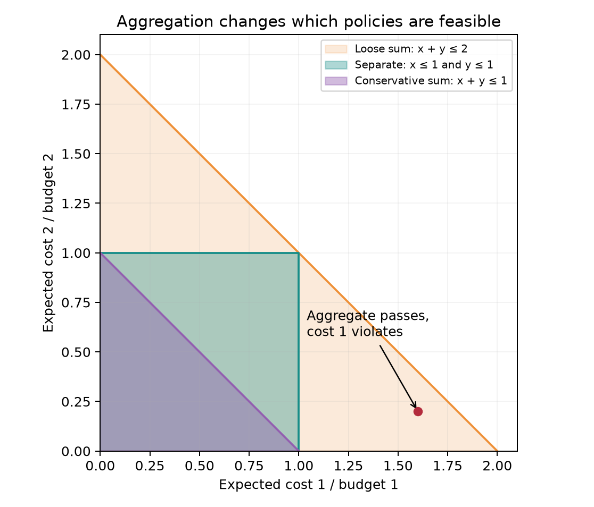

# Multi-cost Safe RL의 수학적 배경

작성 기준: 2026-09-20. 아래 수식은 **보상 최대화, 비용 상한 제약**으로 부호를 통일한다. 논문의 정리와 직접 유도한 설명을 구분하며, 구현 예시는 이 저장소의 [`train.py`](train.py), [`toy_env.py`](toy_env.py)를 기준으로 한다. Humanoid 실험 설계는 [`exp-setup.md`](exp-setup.md), 최근 문헌은 [`recent-work.md`](recent-work.md)를 함께 참고한다.

핵심 연구 질문은 다음처럼 잡는 것이 정확하다.

> 서로 다른 안전 비용을 하나로 합치는 대신 개별 예산과 개별 승수로 관리하면, 각 안전 기준을 만족하면서 얻는 보상과 학습 안정성이 개선되는가?

**제약이 늘어난다고 policy의 자유도가 커지는 것은 아니다.** 좋아질 수 있는 것은 안전 요구의 표현, 비용별 학습 신호, 조절 가능한 패널티의 방향이다. 이 차이를 먼저 이해해야 실험 결과를 과장하지 않는다.

## 1. MDP에서 여러 제약을 가진 CMDP로

환경과 정책을 다음과 같이 쓴다.

| 기호 | 뜻 |
|---|---|
| $\mathcal S,\mathcal A$ | 상태 공간, 행동 공간 |
| $P(s'\mid s,a)$ | 전이 분포 |
| $\rho_0$ | 초기 상태 분포 |
| $\pi_\theta(a\mid s)$ | 파라미터 $\theta$를 갖는 확률적 정책 |
| $r_t=r(s_t,a_t,s_{t+1})$ | 할 일의 성과를 나타내는 보상 |
| $c_{i,t}=c_i(s_t,a_t,s_{t+1})$ | $i$번째 안전 비용; 여기서는 $c_i\ge0$ |
| $d_i$ | $i$번째 비용의 허용 예산 |
| $m$ | 비용 종류의 수 |
| $\gamma$ | 할인율 |
| $H$ | 유한 episode의 길이 |

예를 들어 humanoid가 걷는 과제에서는 전진 성과가 $r$, 비허용 신체 접촉·관절 한계 접근·과도한 구동력이 각각 $c_1,c_2,c_3$가 될 수 있다. 어떤 항을 비용으로 삼을지는 **안전 요구**에 따라 정한다. 에너지를 줄이는 것 자체가 단순한 성능 선호라면 효율 목적이고, actuator의 허용 범위를 표현한다면 안전 제약이다.

할인 누적량을 사용하면

$$
J_r(\pi)=\mathbb E_{\rho_0,P,\pi}\left[\sum_{t=0}^{\infty}\gamma^t r_t\right],
\qquad
J_{c_i}(\pi)=\mathbb E\left[\sum_{t=0}^{\infty}\gamma^t c_{i,t}\right].
$$

우리가 풀 문제는

$$
\boxed{
\max_\pi J_r(\pi)
\quad\text{subject to}\quad
J_{c_i}(\pi)\le d_i,\quad i=1,\ldots,m.
}
$$

이를 **multi-constraint CMDP** 또는 **multi-cost constrained RL**이라고 부를 수 있다. $m=1$인 CMDP를 벡터로 확장한 형태이며, 여러 제약 자체는 새로운 문제 정의가 아니다. CPO도 일반 문제를 여러 제약으로 정의한다. 구현의 실제 지원 범위와 논문의 일반 수식은 별도로 확인해야 한다. [Achiam et al., 2017](https://proceedings.mlr.press/v70/achiam17a.html)

## 2. 비용 예산의 단위: 가장 먼저 고정할 것

다음 세 개는 다른 수량이다.

$$
\begin{aligned}
J_{c_i}^{\mathrm{episode}}&=\mathbb E\left[\sum_{t=0}^{H-1}c_{i,t}\right],\\
J_{c_i}^{\mathrm{rate}}&=\frac1H\mathbb E\left[\sum_{t=0}^{H-1}c_{i,t}\right],\\
J_{c_i}^{\gamma}&=\mathbb E\left[\sum_{t=0}^{H-1}\gamma^t c_{i,t}\right].
\end{aligned}
$$

고정 길이 $H$에서 rate 예산이 $\bar d_i$라면 episode 예산은 $d_i=H\bar d_i$이다. 하지만 임의의 정책에서 할인 비용과 비할인 비용 사이에는 동일한 상수 변환이 없다. 발생 시점이 다르기 때문이다.

예를 들어 매 step 비용이 항상 $p$인 특별한 경우에만

$$
J_c^{\mathrm{episode}}=Hp,
\qquad
J_c^\gamma=p\frac{1-\gamma^H}{1-\gamma}.
$$

$H=1000,\gamma=0.99,p=0.01$이면 비할인 비용은 $10$, 할인 비용은 약 $1$이다. episode budget $10$을 할인 critic의 목표량과 무심코 비교하면 제약 의미가 크게 달라진다.

무한 horizon의 정규화된 할인량은

$$
\bar J_c=(1-\gamma)J_c
$$

이며 같은 제약을 쓰려면 $\bar d=(1-\gamma)d$도 함께 바꾼다. 이를 유한 episode의 평균 비용률과 자동으로 동일시하지 않는다.

**현재 toy 구현:** $H=64$, $\gamma=1$, 전체 episode 합을 사용한다. 위험 구역 점유와 제어 effort의 예산은 각각 $1.92=64\times0.03$, $7.68=64\times0.12$이다. 성공 후 남은 시간은 보상과 비용이 $0$인 흡수 상태로 채운다. 따라서 분모가 정책에 따라 달라지는 문제가 없다.

주의할 별도 설계는 다음과 같다.

- 실제 종료 길이 $T$로 나눈 $\mathbb E[C/T]$, $\mathbb E[C]/\mathbb E[T]$, 고정 $H$로 나눈 $\mathbb E[C]/H$는 서로 다르다.
- 빨리 넘어져 episode가 끝나면 누적 비용이 작아지는 현상이 생길 수 있다. 실패 비용·고정 시간 평가·성공률을 함께 설계해야 한다.
- 이산 step의 접촉 횟수는 control frequency에 의존한다. 접촉 시간을 의도했다면 $\Delta t\,\mathbf1[\text{접촉}]$, 에너지를 의도했다면 $\Delta t\sum_j|\tau_j\dot q_j|$처럼 물리 단위를 명시한다.

## 3. Occupancy measure로 보면 왜 문제가 선형이 되는가

설명을 위해 유한 상태·행동 공간과 공통 $0<\gamma<1$을 가정하자. 정책이 상태–행동 쌍을 얼마나 방문하는지 나타내는 정규화된 occupancy measure를

$$
x_\pi(s,a)=(1-\gamma)\sum_{t=0}^{\infty}\gamma^t
\Pr_\pi(s_t=s,a_t=a)
$$

로 정의한다. 그러면 $x\ge0$, $\sum_{s,a}x(s,a)=1$이고, 확률 흐름 보존식은

$$
\sum_a x(s,a)
=(1-\gamma)\rho_0(s)
+\gamma\sum_{s',a'}P(s\mid s',a')x(s',a').
$$

전이에 의존하는 비용이면 $\bar c_i(s,a)=\mathbb E[c_i(s,a,s')\mid s,a]$를 사용한다. 보상도 마찬가지로 $\bar r$로 쓴다. 그러면

$$
J_r(\pi)=\frac{\langle x_\pi,\bar r\rangle}{1-\gamma},
\qquad
J_{c_i}(\pi)=\frac{\langle x_\pi,\bar c_i\rangle}{1-\gamma}.
$$

따라서 CMDP는 다음 선형계획법(LP)으로 쓸 수 있다.

$$
\begin{aligned}
\max_x\quad &\langle x,\bar r\rangle\\
\text{subject to}\quad
&\langle x,\bar c_i\rangle\le(1-\gamma)d_i,\quad i=1,\ldots,m,\\
&x\ge0,\quad x\text{가 위 흐름 보존식을 만족}.
\end{aligned}
$$

가능한 $x$에서 정책을 복원할 때는

$$
\pi(a\mid s)=\frac{x(s,a)}{\sum_bx(s,b)}
$$

를 쓴다. 분모가 $0$인 방문하지 않는 상태에서는 정책을 임의로 정의해도 그 occupancy에 영향을 주지 않는다.

유한 horizon에서도 $x_t(s,a)=\Pr(s_t=s,a_t=a)$를 두고 시간별 흐름식을 쓰면 같은 방식으로 LP가 된다. 이 경우 일반적으로 정책을 $\pi_t(a\mid s)$로 쓰거나 상태에 남은 시간을 넣어야 한다.

이 관점은 직접 신경망 파라미터 $\theta$를 최적화하는 문제가 비볼록이어도, 충분히 일반적인 정책을 occupancy로 표현하면 숨은 볼록 구조가 있음을 설명한다. 일반 CMDP의 duality 결과와 유한 신경망 PPO의 수렴 보장은 구분해야 한다. [Paternain et al., 2019, §3–4](https://arxiv.org/html/1910.13393v1)

## 4. “cost가 여러 개면 policy 자유도가 커진다”의 정확한 해석

기존 제약들을 그대로 둔 채 하나를 추가하면

$$
\mathcal F_{m+1}
=\mathcal F_m\cap\{\pi:J_{c_{m+1}}(\pi)\le d_{m+1}\}
\subseteq\mathcal F_m.
$$

따라서 정확한 최적화에서

$$
\max_{\pi\in\mathcal F_{m+1}}J_r(\pi)
\le
\max_{\pi\in\mathcal F_m}J_r(\pi).
$$

policy network의 입력·출력·파라미터 수를 바꾸지 않았다면 정책 표현력 자체도 그대로다. 달라질 수 있는 것은 **하나로 합친 비용을 어떤 제약들로 대체했는가**이다.

### 4.1 느슨한 합산 제약: 개별 위반을 가릴 수 있다

$w_i>0$이고

$$
\sum_iw_iJ_{c_i}\le\sum_iw_id_i
$$

만 요구한다면

$$
\mathcal F_{\mathrm{vector}}\subseteq\mathcal F_{\mathrm{sum}}.
$$

개별 예산이 $(1,1)$일 때 비용 $(1.8,0.1)$은 합산 예산 $2$를 만족하지만 첫 비용을 위반한다. 따라서 합산 baseline이 더 높은 보상을 얻어도 안전 기준을 동일하게 만족한 결과가 아닐 수 있다. 반대로 vector 방법의 정확한 최적 보상이 이 느슨한 문제의 정확한 최적 보상보다 커질 수는 없다. 유한 학습에서 그런 결과가 나오면 최적화·표현·추정의 차이를 조사한다.

### 4.2 보수적인 합산 제약: 필요 이상으로 제한할 수 있다

$d_i>0$일 때 정규화 비용 $z_i=J_{c_i}/d_i$를 쓰자. 비음수 비용에 대해

$$
\underbrace{\left\{\sum_i z_i\le1\right\}}_{\text{보수적 합산}}
\subseteq
\underbrace{\{z_i\le1\ \forall i\}}_{\text{개별 제약}}
\subseteq
\underbrace{\left\{\sum_i z_i\le m\right\}}_{\text{느슨한 합산}}.
$$

예를 들어 $(z_1,z_2)=(0.8,0.8)$은 개별 기준을 모두 만족하지만 보수적 합산 기준에는 실패한다. 이 비교에서 vector 제약의 보상이 좋아지는 것은 **과도한 제한을 해제했기 때문**일 수 있다. 이를 알고리즘 자체의 우월성으로 해석하지 않는다.

### 4.3 scalar로 표현했다는 것과 정보를 잃었다는 것은 다르다

다음 제약은 개별 제약과 정확히 동치이다.

$$
\max_i\left(\frac{J_{c_i}(\pi)}{d_i}-1\right)\le0.
$$

하지만 이것은 **기댓값을 계산한 후의 max**이다. 매 step $\max_i c_{i,t}/d_i$를 하나의 비용으로 만드는 것과 다르다. 후자는

$$
\max_i\mathbb E\left[\sum_t\frac{c_{i,t}}{d_i}\right]
\le
\mathbb E\left[\sum_t\max_i\frac{c_{i,t}}{d_i}\right]
$$

이므로 더 보수적일 수 있다. 같은 “single cost”라는 이름으로 이들을 섞지 않는다.

**검증할 가설:** 비용별 critic과 독립적인 승수가 위험 신호의 상쇄를 줄이고, 불필요한 비용 패널티를 낮추어, 개별 안전 기준을 만족하는 정책을 더 안정적으로 학습하게 하는가?

## 5. 왜 확률적 정책이 필요할 수 있는가

한 step 문제에서 두 행동의 비용이 각각

$$
c(A)=(2,0),\qquad c(B)=(0,2),\qquad d=(1,1)
$$

이라고 하자. 두 행동의 보상이 같다면 deterministic 정책은 어느 행동을 선택해도 한 제약을 위반한다. 반면

$$
\pi(A)=\pi(B)=\frac12
\quad\Longrightarrow\quad
J_c=(1,1)
$$

이 되어 기대 비용 제약을 만족한다. 따라서 deterministic evaluation으로 바꾸는 것은 단순히 잡음을 제거하는 것이 아니라 **정책을 바꾸는 것**이다. 학습한 확률적 정책과 평균 행동 정책을 별도로 평가해야 한다.

이 예시는 기대 제약의 한계도 보여 준다. 평균은 안전하지만 **모든 episode는 한 기준을 위반한다.** 기대 비용과 episode별 안전은 다른 요구이다.

## 6. Lagrangian: 비용별 패널티를 자동 조절하기

위반량 $g_i(\theta)=J_{c_i}(\theta)-d_i$를 정의하고, 승수 $\lambda_i\ge0$를 둔다. 보상 최대화 convention에서는

$$
\boxed{
L(\theta,\boldsymbol\lambda)
=J_r(\theta)-\sum_{i=1}^m\lambda_i\bigl(J_{c_i}(\theta)-d_i\bigr).
}
$$

고정된 $\theta$에 대해 제약이 모두 만족되면 $\inf_{\lambda\ge0}L=J_r$이다. 하나라도 위반하면 해당 $\lambda_i\to\infty$로 보내 $L\to-\infty$가 된다. 따라서

$$
\max_\theta\inf_{\lambda\ge0}L(\theta,\lambda)
$$

는 원래 constrained 문제를 표현한다.

정책 업데이트에서 $\sum_i\lambda_id_i$는 $\theta$와 무관한 상수이므로

$$
\nabla_\theta L
=\nabla_\theta J_r-\sum_i\lambda_i\nabla_\theta J_{c_i}.
$$

승수는 “현재 단위 비용을 추가로 줄이는 데 얼마의 보상을 포기할 것인가”를 나타내는 적응적 가격으로 이해할 수 있다. 고정 penalty weight와 달리 제약 위반에 따라 학습된다.

### 6.1 Dual 문제와 업데이트 부호의 유도

최대화 문제의 dual function을

$$
D(\lambda)=\sup_\pi L(\pi,\lambda)
$$

로 정의한다. $L$이 $\lambda$에 대해 affine이므로 $D$는 affine 함수들의 pointwise supremum, 즉 **볼록함수**다. feasible $\pi$에 대해서는 $L(\pi,\lambda)\ge J_r(\pi)$이므로

$$
P^*\le\inf_{\lambda\ge0}D(\lambda)=D^*.
$$

정확한 inner maximizer $\pi_\lambda\in\arg\max_\pi L(\pi,\lambda)$가 존재한다고 가정하면

$$
\begin{aligned}
D(\lambda')
&\ge L(\pi_\lambda,\lambda')\\
&=D(\lambda)
+\bigl(d-J_c(\pi_\lambda)\bigr)^\top(\lambda'-\lambda).
\end{aligned}
$$

따라서 $d-J_c(\pi_\lambda)$가 $D$의 subgradient이며, projected **descent**는

$$
\boxed{
\lambda_{i,k+1}
=\left[\lambda_{i,k}+\eta_\lambda\bigl(J_{c_i}(\pi_k)-d_i\bigr)\right]_+.
}
$$

위반하면 승수가 증가하고, 여유가 있으면 감소한다. $[x]_+=\max(x,0)$는 비음수 영역으로의 projection이다. 정책은 $L$에 대해 **ascent**, 승수는 $L$ 및 dual에 대해 **descent**이지만, 최종 승수 수식에는 $+\eta_\lambda(J_c-d)$가 들어간다.

실제 PPO 몇 epoch가 inner maximization을 정확히 풀지는 않는다. 따라서 rollout의 $d-\hat J_c$를 항상 정확한 dual subgradient라고 부르면 안 된다. 구현은 noisy, approximate primal–dual 방법이다. minimization convention $\min f$의 dual ascent와 부호를 섞지 않는다.

### 6.2 KKT와 보장의 범위

적절한 미분 가능성과 constraint qualification 하에서 국소해의 KKT 조건은

$$
\begin{aligned}
&J_{c_i}(\theta^*)\le d_i &&\text{(primal feasibility)},\\
&\lambda_i^*\ge0 &&\text{(dual feasibility)},\\
&\lambda_i^*\bigl(J_{c_i}(\theta^*)-d_i\bigr)=0 &&\text{(complementary slackness)},\\
&\nabla_\theta J_r(\theta^*)-\sum_i\lambda_i^*\nabla_\theta J_{c_i}(\theta^*)=0 &&\text{(stationarity)}.
\end{aligned}
$$

여유 있는 제약은 이상적인 해에서 $\lambda_i^*=0$이고, $\lambda_i^*>0$이면 해당 제약이 경계에 있다. 역으로 경계에 있다는 이유만으로 승수가 반드시 양수인 것은 아니다.

유한 CMDP의 feasible하고 bounded인 occupancy LP는 LP duality를 적용할 수 있다. 더 일반적인 공간에서는 bounded reward, Slater 조건 등 정리의 가정을 확인해야 한다. 신경망 파라미터 공간에서는 KKT가 일반적으로 전역 최적성을 보장하지 않는다. zero-duality-gap 정리는 아무 신경망 PPO 구현이나 전역 최적해로 수렴한다는 말이 아니다. [Paternain et al., 2019, Theorem 1 및 §4–5](https://arxiv.org/html/1910.13393v1)

## 7. 개별 승수가 제공하는 유연성

합산 비용 $c_\Sigma=\sum_iw_ic_i$에 승수 하나 $\lambda$를 사용하면 정책 gradient는

$$
\nabla J_r-\sum_i(\lambda w_i)\nabla J_{c_i}
$$

이다. 유효 패널티 벡터는 항상

$$
\lambda(w_1,\ldots,w_m)
$$

이라는 한 방향 위에 놓인다. 반면 vector 제약은

$$
(\lambda_1,\ldots,\lambda_m)\in\mathbb R_+^m
$$

를 각각 조절한다. 예를 들어 접촉만 위반하고 effort에는 여유가 있으면 $\lambda_{\mathrm{contact}}$는 높이고 $\lambda_{\mathrm{effort}}$는 낮출 수 있다. 합산 방식은 두 비용의 상대 가격이 고정되어 있다.

따라서 “자유도 증가”를 쓰려면 **정책의 자유도가 아니라 penalty 조절 방향의 자유도**라고 표현하는 것이 정확하다. 이것도 성능 개선의 충분조건은 아니다. 비용 추정 오차, gradient 충돌, 추가 critic 학습의 어려움이 함께 늘 수 있다.

## 8. Reward critic과 비용별 critic

유한 horizon에서는 상태 $s$에 시간 정보가 포함되어 있다고 생각하자. 각 신호 $u\in\{r,c_1,\ldots,c_m\}$에 대해

$$
\begin{aligned}
V_u^\pi(s_t)&=\mathbb E_\pi\left[\sum_{\ell=0}^{H-t-1}\gamma^\ell u_{t+\ell}\mid s_t\right],\\
Q_u^\pi(s_t,a_t)&=\mathbb E_\pi\left[\sum_{\ell=0}^{H-t-1}\gamma^\ell u_{t+\ell}\mid s_t,a_t\right],\\
A_u^\pi(s_t,a_t)&=Q_u^\pi(s_t,a_t)-V_u^\pi(s_t).
\end{aligned}
$$

비용 advantage $A_{c_i}>0$는 “이 행동이 현재 정책의 평균 행동보다 해당 비용을 더 발생시킨다”는 뜻이다. reward advantage와 달리 정책 update에서 빼야 한다.

구현은 공유 feature trunk와 $m+1$개의 출력 head를 둘 수도 있고, 완전히 분리된 network를 둘 수도 있다. 중요한 것은 각 cost의 target을 보존하는 것이다. 단순히 aggregate scalar critic 하나를 학습하면 비용별 advantage를 복원할 수 없다.

고정된 승수에 대한 actor의 mixed advantage는

$$
\boxed{
A^{\mathrm{Lag}}(s,a)=A_r(s,a)-\sum_i\lambda_iA_{c_i}(s,a).
}
$$

예산 $d_i$는 현재 상태에서 남은 비용을 정의하는 것이 아니라 초기 분포에서의 기대 누적량 제약이다. 그래서 ordinary Lagrangian의 per-step advantage에 $d_i$를 매번 빼지 않는다. 예산은 승수 update에 들어간다.

## 9. 비용별 GAE와 종료 처리

TD residual과 GAE를 각 신호에 적용한다.

$$
\delta_t^u=u_t+\gamma b_tV_u(s_{t+1})-V_u(s_t),
$$

$$
\hat A_t^u=\delta_t^u+\gamma\ell_{\mathrm{GAE}}q_t\hat A_{t+1}^u.
$$

여기서 $\ell_{\mathrm{GAE}}\in[0,1]$는 bias–variance 조절 계수이고, $\lambda_i$는 제약 승수다. 서로 전혀 다른 변수다. $b_t$는 bootstrap을 허용하는지, $q_t$는 현재 rollout 안에서 trace를 다음 transition으로 이어도 되는지를 나타낸다. GAE는 TD residual의 지수 가중합이다. [Schulman et al., 2015/2016](https://arxiv.org/abs/1506.02438)

| 경계 종류 | $b_t$ | trace 처리 |
|---|---:|---|
| MDP의 실제 terminal | 0 | 다음 episode로 이어 붙이지 않음 |
| task 자체에 정의된 유한 horizon 종료 | 0 | 남은 return이 0 |
| 계속되는 task를 외부 time limit으로 잘라 reset | 1 | final observation으로 bootstrap, trace는 reset 앞에서 종료 |
| rollout buffer만 끝남; 환경은 계속 | 1 | 마지막 실제 상태 가치로 bootstrap |

자동 reset 환경에서는 새 episode 첫 observation으로 bootstrap하면 안 된다. 종료 직전의 `final_observation` 또는 동등한 실제 마지막 상태를 사용한다. task에 내재한 유한 horizon이라면 남은 시간을 observation에 포함해 Markov 성질을 유지한다. [Farama Foundation, Terminated–Truncated API](https://farama.org/Gymnasium-Terminated-Truncated-Step-API)

현재 toy는 전체 intrinsic episode를 수집하므로 마지막 값은 $V_u(s_H)=0$으로 처리한다. $\gamma=1$, $\ell_{\mathrm{GAE}}=1$이면 telescoping으로

$$
\hat A_t^u=\sum_{k=t}^{H-1}u_k-V_u(s_t)
$$

가 된다. 기본 $\ell_{\mathrm{GAE}}=0.95$는 분산을 줄이는 대신 부정확한 critic에 의한 bias를 허용한다.

## 10. Policy gradient에서 PPO surrogate로

trajectory $\tau$의 확률은

$$
p_\theta(\tau)=\rho_0(s_0)\prod_t\pi_\theta(a_t\mid s_t)P(s_{t+1}\mid s_t,a_t).
$$

환경 전이는 $\theta$와 독립이므로

$$
\nabla_\theta\log p_\theta(\tau)=\sum_t\nabla_\theta\log\pi_\theta(a_t\mid s_t).
$$

likelihood-ratio identity와 causality를 적용하고, 상태 baseline의 기대 gradient가 $0$임을 이용하면

$$
\nabla_\theta L
=\mathbb E\left[\sum_{t=0}^{H-1}\gamma^t
\nabla_\theta\log\pi_\theta(a_t\mid s_t)
\left(A_r(s_t,a_t)-\sum_i\lambda_iA_{c_i}(s_t,a_t)\right)\right]
$$

를 얻는다. 이 식에서는 reward와 모든 cost가 같은 할인율과 같은 초기 분포를 사용한다. 서로 다른 할인율을 쓰면 시간 가중치도 달라지므로 단일 mixed advantage를 무조건 같은 가중치로 평균내는 것이 정확한 gradient는 아니다.

PPO에서는 old policy로 모은 데이터에서 likelihood ratio를

$$
\rho_t(\theta)=\frac{\pi_\theta(a_t\mid s_t)}{\pi_{\mathrm{old}}(a_t\mid s_t)}
$$

로 정의하고, 다음 mixed surrogate를 최대화한다.

$$
\hat L_{\mathrm{PPO}}(\theta)
=\frac1N\sum_t
\min\left(
\rho_t(\theta)\hat A_t^{\mathrm{Lag}},
\operatorname{clip}(\rho_t(\theta),1-\epsilon,1+\epsilon)\hat A_t^{\mathrm{Lag}}
\right).
$$

이는 원래 PPO의 clipped surrogate에 Lagrangian advantage를 넣은 실용적 baseline이다. [Schulman et al., 2017](https://arxiv.org/abs/1707.06347)

주의할 점은 네 가지다.

1. clipping은 개별 $J_{c_i}\le d_i$나 각 행동의 안전을 보장하지 않는다. KL early stopping도 물리적 안전 보장은 아니다.
2. $\min$과 clipping은 비선형이므로 “먼저 reward/cost advantage를 혼합한 뒤 clip”과 “각 objective를 따로 clip한 뒤 조합”은 다른 알고리즘이다.
3. 한 rollout의 PPO epochs 동안 승수를 고정하면 surrogate 목표가 중간에 바뀌는 것을 피할 수 있다.
4. $\gamma<1$인 초기상태 return의 정확한 gradient에는 위 식의 $\gamma^t$ 또는 대응하는 discounted sampling이 필요하다. 이를 생략하는 일반적 구현은 정확히 어떤 surrogate를 쓰는지 밝혀야 한다. 현재 toy의 $\gamma=1$은 이 불일치를 피한다.

## 11. 정규화할 때 제약 의미 보존하기

양수 상수 $s_i$로

$$
\tilde c_i=\frac{c_i}{s_i},\qquad
\tilde d_i=\frac{d_i}{s_i}
$$

를 정의하면 feasible set은 동일하다. 하지만 같은 Lagrangian을 유지하는 승수 관계는

$$
\tilde\lambda_i=s_i\lambda_i
$$

이다. 실제로

$$
\tilde\lambda_i(\tilde J_{c_i}-\tilde d_i)
=\lambda_i(J_{c_i}-d_i).
$$

같은 수치의 dual learning rate를 그대로 사용하는 것은 같은 학습 dynamics를 의미하지 않는다. raw-space 학습률이 $\eta_i$라면 이 좌표변환에 대응하는 normalized-space 학습률은 $s_i^2\eta_i$다. 따라서 **feasible set 동치**와 **optimizer 동치**를 구분한다.

현재 toy는 $s_i=d_i>0$로 두어

$$
\tilde J_{c_i}=\frac{J_{c_i}}{d_i},\qquad \tilde d_i=1,
\qquad
\tilde\lambda_i^+=\left[\tilde\lambda_i+\eta_\lambda(\tilde J_{c_i}-1)\right]_+
$$

를 사용한다. raw costs도 별도로 기록하므로 보고할 때 원래 예산과 비교할 수 있다. 예산이 $0$이면 나눌 수 없으므로 별도의 양수 scale을 정한다.

비용별 advantage를 매 batch 자기 표준편차로 나누면

$$
A_r-\sum_i\lambda_i\frac{A_{c_i}}{\sigma_i}
$$

가 되어 유효 승수가 $\lambda_i/\sigma_i$로 바뀐다. $\sigma_i$가 계속 변하므로 원래 비용 단위에서의 penalty 해석이 흔들린다. 첫 baseline에서는 **cost와 budget을 고정 scale로 정규화 → GAE → 혼합 → 혼합 결과만 한 번 표준화**하는 편이 해석하기 쉽다.

혼합 결과의 표준화도 학습률·entropy coefficient·finite-sample PPO clipping과 상호작용한다. 따라서 원래 목적의 완전히 동일한 optimizer라고 주장하지 않는다. 비용 사이의 상대 scale을 보존하는 실용적 선택이다.

## 12. 승수가 진동하는 이유와 infeasible budget

평범한 승수 update를 펼치면 projection이 없을 때

$$
\lambda_{i,k}=\lambda_{i,0}+\eta_\lambda\sum_{j<k}(\hat J_{c_i,j}-d_i)
$$

이다. 즉 누적 위반을 적분하는 형태다. 정책이 비용을 줄이는 데 지연이 있으면 승수가 계속 올라가고, 뒤늦게 비용이 낮아진 다음 다시 보상을 추구하면서 진동할 수 있다. PID Lagrangian은 이 문제를 control 관점에서 다룬다. [Stooke, Achiam & Abbeel, 2020](https://proceedings.mlr.press/v119/stooke20a.html)

승수 학습률 감소, rollout 확대, 비용 추정의 smoothing은 별도 ablation으로 검토할 수 있다. 학습률을 줄이면 반응이 느려질 수도 있으므로 안정화가 자동으로 보장되지는 않는다. primal–dual에서 평균 iterate 수렴과 현재 마지막 정책 수렴은 다른 성질이며, 이 차이가 실제 평가에 중요하다. [Moskovitz et al., 2023](https://proceedings.mlr.press/v202/moskovitz23a.html)

모든 제약을 동시에 만족하는 정책이 없으면 어떤 승수 update도 문제를 해결할 수 없다. 특히 각 비용을 **따로** 줄일 수 있다는 사실은 **동시에** 줄일 수 있다는 뜻이 아니다. 다음 feasibility phase를 생각할 수 있다.

$$
\min_{\pi,\xi\ge0}\xi
\quad\text{subject to}\quad
J_{c_i}(\pi)\le d_i+\xi s_i,\quad\forall i.
$$

전역 최적값이 $0$이면 feasible 정책이 존재한다. 신경망 학습에서 $\xi>0$을 얻었다고 비실현 가능성을 증명한 것은 아니다. 예산이 너무 엄격한지, 학습이 실패했는지 추가 확인해야 한다.

학습을 안정화하려고 $\lambda$ 상한을 넣는다면 로그에 명시한다. 상한에 걸린 승수는 위반을 충분히 벌하지 못할 수 있다. 마지막 checkpoint가 위반하면, 성공한 일부 중간 checkpoint만 골라 전체 run이 성공했다고 말하지 않는다. feasible checkpoint selection은 validation 데이터와 사전 규칙을 사용하고, held-out evaluation은 선택에 쓰지 않는다.

## 13. 기대 비용, 확률 제약, CVaR, shielding은 다르다

episode 비용을 $C_i(\tau)=\sum_tc_{i,t}$라 하자. 일반 CMDP가 요구하는 것은

$$
\mathbb E[C_i]\le d_i.
$$

episode별 임계값 $b_i$를 거의 넘지 말아야 한다면 필요한 것은

$$
\Pr(C_i>b_i)\le\delta_i
$$

같은 chance constraint다. $C_i\ge0$이면 Markov 부등식으로

$$
\Pr(C_i\ge b_i)\le\frac{\mathbb E[C_i]}{b_i}
$$

이지만, $\mathbb E[C_i]\le b_i$만으로는 상한이 $1$이라 의미 있는 rare-event 보장이 나오지 않는다.

상위 꼬리의 심각도를 다루려면 confidence level $\alpha\in(0,1)$에서

$$
\operatorname{CVaR}_\alpha(C_i)
=\min_{z\in\mathbb R}\left\{z+\frac1{1-\alpha}\mathbb E[(C_i-z)_+]\right\}
$$

를 사용해 $\operatorname{CVaR}_\alpha(C_i)\le b_i$를 요구할 수 있다. 평균 비용용 critic을 그대로 쓴다고 CVaR 제약을 학습하는 것은 아니다. 목적과 estimator를 바꿔야 한다. [Chow et al., 2018](https://jmlr.org/papers/v18/15-636.html)

여러 chance constraint가 있을 때 union bound는

$$
\Pr(\exists i:C_i>b_i)\le\sum_i\delta_i
$$

이므로 “각각 95% 안전”이 “동시에 95% 안전”을 뜻하지 않는다.

Shield나 safety filter는 실행 직전에 제안 행동 $a$를 검사하여 다른 행동 $a^{\mathrm{exec}}$로 바꾸는 별도 장치다. 효과가 있다면 그 보장은 dynamics model, safe set, solver, sensing 가정에 의존한다. PPO clipping이나 Lagrange multiplier 자체가 shield가 되지는 않는다.

현재 실험이 평가하는 것은 **simulator에서의 기대 비용 제약 학습**이다. 실제 로봇 안전이나 모든 training trajectory의 안전을 보장하는 실험으로 해석하지 않는다.

## 14. 연구 실험에서 무엇을 비교해야 하는가

원래 안전 요구는 항상 개별 벡터 예산 $J_{c_i}\le d_i$로 고정하고 모든 방법을 그 기준으로 평가한다.

| 비교 | 수학적 차이 | 알아낼 수 있는 것 |
|---|---|---|
| Unconstrained PPO | 안전 패널티 없음 | reward와 비용의 기본 수준 |
| 느슨한 합산 PPO-Lag | $\sum_iJ_{c_i}/d_i\le m$ | 합계가 개별 위반을 숨기는 정도 |
| 보수적 합산 PPO-Lag | $\sum_iJ_{c_i}/d_i\le1$ | 과도한 제한으로 잃는 reward |
| Multi PPO-Lag | $J_{c_i}/d_i\le1$ 각각 | 개별 제약을 관리하는 baseline |
| 비용별 critic + 승수 묶기 | $\lambda_i=\lambda w_i$ | 추가 critic 정보와 독립 승수 효과의 분리 |
| 독립 승수 + critic 구조 변경 | 같은 제약 | shared trunk의 간섭 여부 |

현재 구현은 unconstrained와 scalar baseline에도 동일한 reward + cost heads를 유지한다. 그러면 vector 방법만 추가 auxiliary supervision과 더 큰 critic을 받은 데서 오는 이득을 줄일 수 있다. actor 구조와 학습 budget도 맞춘다.

최소 보고량은 다음과 같다.

$$
\hat J_r,\quad
\hat J_{c_i}\ \forall i,\quad
v_{\max}=\max_i\left[\frac{\hat J_{c_i}}{d_i}-1\right]_+,
\quad
v_{\mathrm{sum}}=\sum_i\left[\frac{\hat J_{c_i}}{d_i}-1\right]_+.
$$

여기에 성공률, episode별 동시 예산 통과율, 학습 중 누적 비용, 비용별 승수, wall time을 함께 기록한다. 비용 평균이 모두 기준 이하여도 episode별 동시 통과율은 낮을 수 있다.

독립 학습 seed를 기본 통계 단위로 삼고, 각 seed에서 충분한 평가 episode를 수집한다. 한 정책의 평가 episode 수를 늘리는 것은 training seed 수를 늘리는 것과 다르다. 예산 경계 부근에서는 평균값과 confidence interval을 함께 보고, 보수적으로 “평가 평균의 상측 신뢰한계가 모든 예산 이하”인지를 추가 지표로 사용할 수 있다. 유한 평가 표본은 수학적 안전 인증이 아니다.

“성능이 좋아졌다”는 주장은 최소한 **동일한 개별 안전 기준을 통과하는 정책 사이의 reward 비교**로 뒷받침해야 한다. 더 높은 reward와 더 큰 위반을 tradeoff로 숨기지 않는다. 전체 reward–violation curve와 마지막 checkpoint 결과도 보존한다.

## 15. 현재 코드와 수식의 대응

| 수학 | 구현 |
|---|---|
| $\pi_\theta$ | `ActorCritic.actor`, diagonal Gaussian 후 `tanh` |
| $V_r,V_{\tilde c_1},\ldots,V_{\tilde c_m}$ | `ActorCritic.critic`의 $m+1$ 출력 |
| intrinsic $H$, $\gamma=1$ | `collect`, 전체 episode 수집, 마지막 bootstrap $0$ |
| $\tilde c_i=c_i/d_i$ | `collect`의 `cost / env.budgets` |
| 비용별 GAE | `generalized_advantage` |
| $A_r-\sum_i\tilde\lambda_iA_{\tilde c_i}$ | `combine_advantages` |
| clipped PPO ascent | policy loss의 음수를 Adam으로 최소화 |
| $[\tilde\lambda_i+\eta(\tilde J_{c_i}-1)]_+$ | `update_multipliers` |
| 개별 예산 평가 | `summarize_rollout`, raw + normalized cost 동시 저장 |

`tanh`로 행동을 제한할 때 $a=\tanh u$는 고정된 일대일 변환이다. 동일한 저장 행동에 대해

$$
\frac{\pi_{\theta}^{a}(a\mid s)}{\pi_{\mathrm{old}}^{a}(a\mid s)}
=\frac{\pi_\theta^{u}(u\mid s)/|\det J_{\tanh}(u)|}
{\pi_{\mathrm{old}}^{u}(u\mid s)/|\det J_{\tanh}(u)|}
=\frac{\pi_\theta^{u}(u\mid s)}{\pi_{\mathrm{old}}^{u}(u\mid s)}.
$$

따라서 PPO ratio는 저장된 latent $u$의 Gaussian log probability로 계산할 수 있다. 하지만 transformed action의 entropy는 latent Gaussian entropy와 같지 않다. 코드의 기본 entropy coefficient는 $0$이며, 이를 켜면 latent entropy에 대한 탐색 heuristic이다.

승수는 한 rollout의 PPO 학습이 끝난 뒤, **그 rollout을 만든 old policy의 비용 추정치**로 갱신된다. 새 정책의 정확한 비용을 측정한 dual step이 아니라, 같은 old batch를 쓰는 approximate primal–dual update다. terminal·GAE·승수 부호·정규화 관계는 [`test_core.py`](test_core.py)에 수치 검증이 있다.

기본 `--constraint-target 1.0`은 보고 예산과 같은 학습 예산을 쓴다. 별도 development run에서 사용한 `--constraint-target 0.9`는 $\tilde J_{c_i}\le0.9$를 학습 목표로 삼는 명시적인 10% 여유다. 이는 원래 문제보다 엄격한 학습 제약이며, 기본 비교의 성능 개선으로 섞어 보고하지 않는다. 평가 기준은 원래 예산 $\tilde J_{c_i}\le1$로 유지한다. 실제 수치와 실패한 시도도 [`training-report.md`](training-report.md)에 남겼다.

성공 이후의 흡수 상태에서도 현재 코드는 actor를 샘플링한다. 실제 return은 행동에 무관하므로 정확한 advantage는 $0$이다. critic이 부정확한 초기에는 불필요한 gradient noise가 생길 수 있다. active-state actor mask는 향후 별도 ablation으로 검토할 수 있지만, 원래 benchmark 비교 중에 한 방법에만 적용하지 않는다.

이 구현은 학습 경로와 제약 의미를 확인하기 위한 baseline이다. toy에서 성공하더라도 humanoid의 고차원 접촉 dynamics, 비용 측정 신뢰성, 긴 horizon 학습 난이도를 해결했다는 증거는 아니다. 실제 실행 결과와 미달한 제약은 실행 보고서에서 별도로 확인한다.

## 참고문헌

아래는 수학과 구현 설명에 사용한 1차 문헌이다. 본문의 예시, 집합 포함 관계, 단위 변환은 이 문서를 위해 직접 유도했다.

1. Joshua Achiam, David Held, Aviv Tamar, Pieter Abbeel. **Constrained Policy Optimization.** ICML 2017, *PMLR* **70**, 22–31. [공식 proceedings](https://proceedings.mlr.press/v70/achiam17a.html).
2. Santiago Paternain, Luiz F. O. Chamon, Miguel Calvo-Fullana, Alejandro Ribeiro. **Constrained Reinforcement Learning Has Zero Duality Gap.** NeurIPS 2019; arXiv:1910.13393. [원문 및 정리](https://arxiv.org/abs/1910.13393).
3. John Schulman, Philipp Moritz, Sergey Levine, Michael I. Jordan, Pieter Abbeel. **High-Dimensional Continuous Control Using Generalized Advantage Estimation.** ICLR 2016; 최초 preprint 2015, arXiv:1506.02438. [원문](https://arxiv.org/abs/1506.02438).
4. John Schulman, Filip Wolski, Prafulla Dhariwal, Alec Radford, Oleg Klimov. **Proximal Policy Optimization Algorithms.** 2017, arXiv:1707.06347. [원문](https://arxiv.org/abs/1707.06347).
5. Adam Stooke, Joshua Achiam, Pieter Abbeel. **Responsive Safety in Reinforcement Learning by PID Lagrangian Methods.** ICML 2020, *PMLR* **119**, 9133–9143. [공식 proceedings](https://proceedings.mlr.press/v119/stooke20a.html).
6. Ted Moskovitz, Brendan O'Donoghue, Vivek Veeriah, Sebastian Flennerhag, Satinder Singh, Tom Zahavy. **ReLOAD: Reinforcement Learning with Optimistic Ascent-Descent for Last-Iterate Convergence in Constrained MDPs.** ICML 2023, *PMLR* **202**, 25303–25336. [공식 proceedings](https://proceedings.mlr.press/v202/moskovitz23a.html).
7. Yinlam Chow, Mohammad Ghavamzadeh, Lucas Janson, Marco Pavone. **Risk-Constrained Reinforcement Learning with Percentile Risk Criteria.** *Journal of Machine Learning Research* **18**(167), 1–51, **2018** (공식 JMLR 페이지의 연도). [공식 논문 페이지](https://jmlr.org/papers/v18/15-636.html).
8. Farama Foundation. **Deep Dive: Gymnasium Terminated–Truncated Step API.** 공식 구현 문서. [문서](https://farama.org/Gymnasium-Terminated-Truncated-Step-API).
