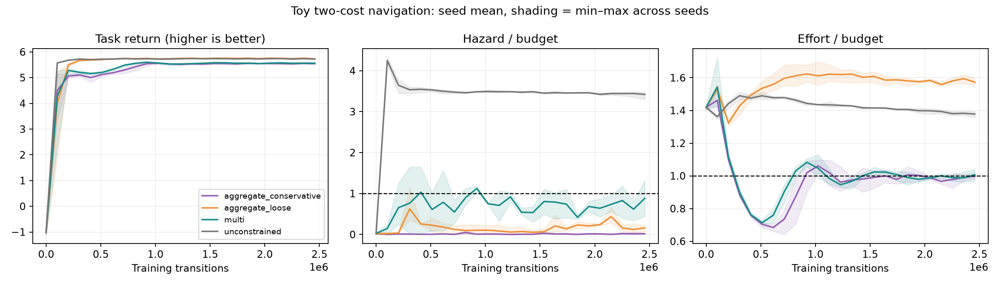

# Completed toy training results

Group: `toy-comparison-v1`. This is a custom navigation CMDP, **not HumanoidBench**.

All policies use the same actor, three critic heads and training budget. Columns show final stochastic-policy held-out evaluation, with mean ± Student-t 95% confidence interval **across training seeds**, not a claim of statistical significance. Three seeds give imprecise intervals. Episode samples are not independent training replicates.

Raw expected-episode budgets: hazard ≤ 1.92 occupied steps, effort ≤ 7.68 (sum of mean squared action). 512 held-out episodes per trained policy. Feasible seeds means both point estimates satisfy their budgets; it is not a high-confidence safety certificate.

| Method | Seeds | Return | Hazard | Effort | Goal success | Mean-feasible seeds |
|---|---:|---:|---:|---:|---:|---:|
| aggregate_conservative | 3 | 5.557 ± 0.015 | 0.043 ± 0.099 | 7.699 ± 0.266 | 100.0% | 1/3 |
| aggregate_loose | 3 | 5.748 ± 0.030 | 0.382 ± 0.403 | 12.115 ± 0.477 | 100.0% | 0/3 |
| multi | 3 | 5.574 ± 0.053 | 1.723 ± 2.273 | 7.741 ± 0.648 | 100.0% | 1/3 |
| unconstrained | 3 | 5.736 ± 0.010 | 6.575 ± 0.374 | 10.600 ± 0.254 | 100.0% | 0/3 |

The scalar controls impose different feasible sets: aggregate_loose uses hazard/1.92 + effort/7.68 ≤ 2; aggregate_conservative uses the same sum ≤ 1. Multi uses both individual ratios ≤ 1. Return differences alone cannot identify an optimization improvement at matched safety.

## Run records

- `runs/toy-comparison-v1-aggregate_conservative-s0`: 2,457,600 training transitions, 47.0 training/evaluation seconds. [W&B](https://wandb.ai/cch-eck-postech/multi-cost-rl/runs/yxywcb5q)
- `runs/toy-comparison-v1-aggregate_conservative-s1`: 2,457,600 training transitions, 68.4 training/evaluation seconds. [W&B](https://wandb.ai/cch-eck-postech/multi-cost-rl/runs/xy96pgrk)
- `runs/toy-comparison-v1-aggregate_conservative-s2`: 2,457,600 training transitions, 46.8 training/evaluation seconds. [W&B](https://wandb.ai/cch-eck-postech/multi-cost-rl/runs/3awt6bh2)
- `runs/toy-comparison-v1-aggregate_loose-s0`: 2,457,600 training transitions, 49.8 training/evaluation seconds. [W&B](https://wandb.ai/cch-eck-postech/multi-cost-rl/runs/cx1rvvwr)
- `runs/toy-comparison-v1-aggregate_loose-s1`: 2,457,600 training transitions, 66.5 training/evaluation seconds. [W&B](https://wandb.ai/cch-eck-postech/multi-cost-rl/runs/q06aeqne)
- `runs/toy-comparison-v1-aggregate_loose-s2`: 2,457,600 training transitions, 53.1 training/evaluation seconds. [W&B](https://wandb.ai/cch-eck-postech/multi-cost-rl/runs/v2f4r54v)
- `runs/toy-comparison-v1-multi-s0`: 2,457,600 training transitions, 48.2 training/evaluation seconds. [W&B](https://wandb.ai/cch-eck-postech/multi-cost-rl/runs/j9yhc7hy)
- `runs/toy-comparison-v1-multi-s1`: 2,457,600 training transitions, 76.5 training/evaluation seconds. [W&B](https://wandb.ai/cch-eck-postech/multi-cost-rl/runs/ou207mvs)
- `runs/toy-comparison-v1-multi-s2`: 2,457,600 training transitions, 46.6 training/evaluation seconds. [W&B](https://wandb.ai/cch-eck-postech/multi-cost-rl/runs/j3oqwszh)
- `runs/toy-comparison-v1-unconstrained-s0`: 2,457,600 training transitions, 48.8 training/evaluation seconds. [W&B](https://wandb.ai/cch-eck-postech/multi-cost-rl/runs/nuhd9miq)
- `runs/toy-comparison-v1-unconstrained-s1`: 2,457,600 training transitions, 51.1 training/evaluation seconds. [W&B](https://wandb.ai/cch-eck-postech/multi-cost-rl/runs/h45r8df9)
- `runs/toy-comparison-v1-unconstrained-s2`: 2,457,600 training transitions, 57.3 training/evaluation seconds. [W&B](https://wandb.ai/cch-eck-postech/multi-cost-rl/runs/oiyqj7sz)

Each directory contains configuration and source hashes, exact source snapshot, JSONL learning curves, final checkpoint, held-out episode returns/costs, and summary. Checkpoints are final-budget policies, never selected on test return.
