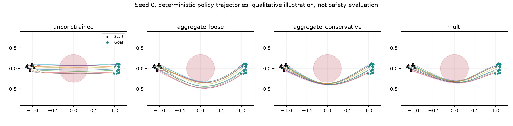

# Completed training session

Training ran on 20 September 2026; this report was finalized on 21 September 2026. All outcomes below come from saved checkpoints and evaluation arrays, not estimated results. The session completed **17 training runs**, including a **12-run, three-seed toy comparison** and a **real HumanoidBench H1 pilot**. No training job is left running.

The local setup works, including online [Weights & Biases tracking](https://wandb.ai/cch-eck-postech/multi-cost-rl). The toy policies learned to reach their goals. Multi-cost PPO-Lagrangian reduced both costs relative to unconstrained PPO, but did not reliably satisfy both budgets across seeds. The short humanoid run did not learn stable walking. These results support continuing the study; they do not establish that cost decomposition improves performance at matched safety.

## 1. What was executed

| Experiment | Runs | Training transitions | Purpose |
|---|---:|---:|---|
| Initial toy smoke | 1 | 10,240 | Numerical path and online W&B check |
| Toy calibration pilot | 1 | 1,228,800 | Confirm task learning and inspect constraint behavior |
| Main toy comparison | 12 | 29,491,200 | Four methods × three independent training seeds |
| Slower-dual development run | 1 | 2,457,600 | Diagnose multiplier oscillation |
| Slower-dual + margin development run | 1 | 2,457,600 | Inspect an explicitly stricter training target |
| Real H1 multi-cost pilot | 1 | 614,400 scheduled; 133,654 actual MuJoCo control steps | Validate physics integration and attempt training |

The total is 36,259,840 scheduled training transitions. For the toy, reaching the goal creates a zero-cost/reward absorbing state until the fixed horizon. For H1, a physical fall creates an absorbing state with continuing fall-risk cost. Consequently, scheduled transitions must not be presented as an equal number of physical simulator interactions.

The machine is an Apple M2 Mac with 16 GB memory. Runs used CPU PyTorch, two Torch threads per process, and an isolated Python 3.11 environment. The main toy suite accumulated about 660 seconds of measured training plus evaluation time; all 17 runs accumulated about 957 seconds. These sums exclude environment setup, dependency downloads, W&B initialization/final synchronization, and report work, and are not elapsed session duration. Some development runs overlapped in time.

The exact package versions are in [requirements-lock.txt](requirements-lock.txt). HumanoidBench is pinned at `cb1189039151c8aadaaa987b442da54383c87fab`; no upstream source was changed. The full GPU cluster was not used because no remote target or scheduler was supplied.

## 2. Main toy experiment

This is the custom `TwoCostNavigation` environment, **not** HumanoidBench or an official Safety Gym result. It has a central circular hazard, continuous movement actions, a goal, and an observed 64-step horizon. Costs are hazard occupancy and the sum of mean squared action. The original episode budgets are:

$$
d_{\mathrm{hazard}}=1.92,\qquad d_{\mathrm{effort}}=7.68.
$$

A hand-coded reference controller reaches the goal in all 512 calibration episodes with zero hazard cost and mean effort 6.746, demonstrating that these toy budgets admit useful behavior. This controller is not used for imitation, initialization or RL evaluation. See [calibration data](results/toy-budget-calibration.json).

Every method used the same actor, reward-plus-two-cost critic heads, PPO settings, training seeds 0–2, and **2,457,600 transitions per seed**. The multiplier learning rate was 0.15. Final policies were evaluated stochastically on 512 held-out episodes each. The final checkpoint was retained regardless of whether its result was favorable; no checkpoint was selected using the test set.

| Method | Mean return | Mean hazard cost | Mean effort cost | Goal success | Seeds satisfying both mean budgets |
|---|---:|---:|---:|---:|---:|
| Unconstrained PPO | 5.736 | 6.575 | 10.600 | 100% | 0/3 |
| Loose aggregate PPO-Lag | 5.748 | 0.382 | 12.115 | 100% | 0/3 |
| Conservative aggregate PPO-Lag | 5.557 | 0.043 | 7.699 | 100% | 1/3 |
| Multi-cost PPO-Lag | 5.574 | 1.723 | 7.741 | 100% | 1/3 |

Numbers are means across training seeds, not a pooled declaration that each policy is feasible. [The complete table and learning curves](results/toy-comparison-v1.md) include Student-t 95% intervals across seeds, all run links and times. With only three seeds, intervals are wide; no statistical superiority claim is justified.


The loose aggregate uses

$$
J_{\mathrm{hazard}}/1.92+J_{\mathrm{effort}}/7.68\le2.
$$

Its three final policies satisfy that aggregate point estimate, while each violates the original effort budget. This is a concrete example of one cost compensating for another. The conservative aggregate uses the same sum with threshold 1. Multi-cost training uses the two individual constraints. Their feasible sets differ, so comparing raw returns is not a clean test of optimizer superiority.

Multi-cost seed 2 is the one final multi-cost policy whose individual cost means pass: return **5.550**, hazard **1.523**, effort **7.462**, goal success **100%**. Only **40.2%** of its individual episodes satisfy both episode budgets. This is consistent with expected-cost constraints and demonstrates why expected feasibility is not a trajectory-level guarantee. It is a descriptive result from the full set of runs, not a selected winner used to hide seeds 0 and 1.

- [Multi-cost seed 2 on W&B](https://wandb.ai/cch-eck-postech/multi-cost-rl/runs/j3oqwszh)
- [Its final checkpoint](runs/toy-comparison-v1-multi-s2/checkpoint.pt)
- [Its raw final evaluation](runs/toy-comparison-v1-multi-s2/evaluation.npz)



The trajectory figure uses seed 0 and deterministic mean actions for illustration. The stochastic held-out evaluation above remains the primary result.

## 3. Development experiments retained separately

The basic multiplier controller oscillated near the boundaries. Two exploratory runs were then made on separate development seeds. Their final evaluation is development evidence, not an untouched confirmatory comparison or a fair ranking against the main suite.

| Development configuration | Seed | Return | Hazard | Effort | Both mean budgets met? |
|---|---:|---:|---:|---:|---|
| Dual learning rate 0.02 | 101 | 5.585 | 0.844 | 7.855 | No: effort |
| Dual learning rate 0.02, training target 90% of reported budgets | 102 | 5.533 | 2.340 | 7.077 | No: hazard |

The margin changes the training problem. It is recorded as `constraint_target=0.9`; evaluation still uses the original budgets. Neither attempt established reliable feasibility. The main comparison was retained unchanged. A useful next algorithmic ablation is a per-cost PID/optimistic controller, with equal tuning budgets across methods, rather than interpreting a smaller learning rate as a guarantee. The relevant references are in [recent-work.md](recent-work.md).

## 4. Actual HumanoidBench pilot

This run used genuine `h1-walk-v0`: 51 original state observations, 19 action dimensions, and the H1 model without dexterous hands. The adapter adds elapsed-time and absorbing-state indicators. The main published morphology, `h1hand-walk-v0`, was not trained in this session.

The three cost channels are:

1. **Fall-risk exposure:** head height below 1.35 m, torso tilt beyond 45 degrees, or physical termination.
2. **Joint-limit proximity:** fraction of limited robot joints in the outer 5% of their modeled range.
3. **Actuator load:** mean squared actual actuator force divided by its enforced model force limit. Actions are position commands, so action magnitude is not substituted for torque.

These are transparent simulator proxies with provisional budgets, not validated hardware safety limits. The wrapper samples control-step endpoints; it does not measure every impact peak. See [the cost definitions and calibration procedure](exp-setup.md).

The run used 8 environments, horizon 256, 300 PPO updates, dual learning rate 0.02 and three separate multipliers. That is 614,400 scheduled transitions, of which 133,654 required actual simulator stepping; remaining transitions were post-failure padding. Training plus evaluation took approximately 131 seconds. A separate 1,000-step random-action simulator test measured about 2,252 control steps/s, including resets. This simulator-only number is not a cluster or complete training throughput estimate.

Final stochastic evaluation used 32 fresh episodes:

| Quantity | Final value | Budget / interpretation |
|---|---:|---|
| Episode return | 5.161 | 256-step modified horizon; not comparable to official 1,000-step success scores |
| Fall-risk cost | 223.594 | Budget 12.8: strongly violated |
| Joint-limit cost | 1.268 | Budget 12.8: mean below budget |
| Actuator-load cost | 28.224 | Budget 51.2: mean below budget |
| Physical fall rate | 100% | Stable walking not learned |
| Forward displacement | −0.149 m | No successful forward locomotion claim |

The fall-risk multiplier rose to approximately 101 while the other multipliers fell to zero. This is a useful failure diagnostic: one constraint dominates while the base locomotion task is unsolved. The initially low joint/load costs do not establish successful safe locomotion, and early failure itself reduces their remaining accumulation. The continuing fall-risk charge prevents that failure from passing the full vector specification.

[H1 run on W&B](https://wandb.ai/cch-eck-postech/multi-cost-rl/runs/jfn5p0c9) · [checkpoint](runs/humanoid-pilot-multi-s0/checkpoint.pt) · [configuration](runs/humanoid-pilot-multi-s0/config.json) · [raw evaluation](runs/humanoid-pilot-multi-s0/evaluation.npz).

The next physical experiment should first establish repeatable reward-only walking at the native horizon, then calibrate budgets from successful trajectories. If safety training uses pretrained walking checkpoints, every compared method should share those initial checkpoints, and pretraining compute should be reported separately. The current pilot is insufficient to decide whether the specified humanoid budgets are jointly attainable.

## 5. Verification and reproducibility

The verification completed:

- Six numerical/core tests for finite-horizon returns, multiplier signs and projection, cost scaling, absorbing goal behavior, seeding and tanh likelihood ratios.
- Five actual-physics integration tests for reward/dynamics preservation, fall detection, joint-stop detection, actual force measurement and invalid configurations.
- Reload-and-replay checks that reproduce the stored per-episode returns and costs for the toy multi-cost seed 0 checkpoint and the real H1 checkpoint.
- Dependency consistency check: no broken requirements.
- W&B API check that a completed pilot is finished and its recorded metrics match the local summary.

Evidence is saved in [tests.txt](results/tests.txt), [toy checkpoint replay](results/checkpoint-replay-verification.json), and [H1 checkpoint replay](results/humanoid-checkpoint-replay.json). Each run stores `config.json`, `source/` snapshots with hashes, `metrics.jsonl`, final model/optimizer/multiplier state, raw evaluation arrays, and `summary.json`. Small logging/metadata and optional-configuration additions occurred during the session; the exact source snapshot for each run is retained. The primary CPU algorithm and settings remained the same across the comparison.

Reproduction commands are in [README.md](README.md). For example, to verify the saved physical policy again:

```bash
.venv-train/bin/python evaluate.py runs/humanoid-pilot-multi-s0/checkpoint.pt --verify-saved
```

The checkpoints support evaluation. Exact interrupted-training resume is not implemented; that would also need environment and random-generator states. No test or finite evaluation sample provides a physical safety certificate.
